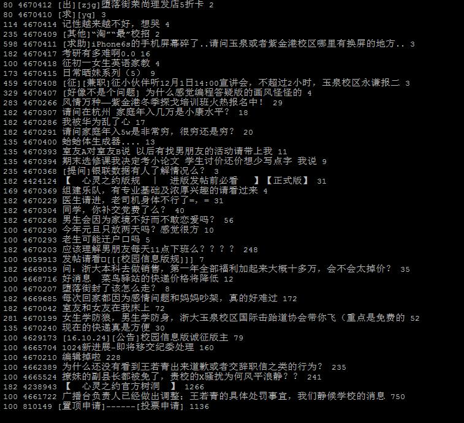

# cc98 Crawler

## Snapshot



## 依赖

* Python3
* 数据库： `mysql-server`
* 缓存：`redis-server`
* pip包：

`pip3 install bs4 requests pymysql redis`

## 为什么需要redis

在爬取特定帖子前比较点击数与缓存的点击数，如果点击量没有发生变化则不爬取

缓存则使用redis实现，以保证多次爬取之间缓存的持久性

如果缓存失效，将重新全部爬取一遍

## 代码

主要的代码在这里： [xinling.py](xinling.py)

util目录下py文件为方便管理用的一些代码，主要代码中不会import

## 说明

### config.py

如果你想运行本爬虫，需要在config.py中提供以下内容：

1. COOKIE: dict, 你的cc98登录身份的cookie，至少需要包含aspsky，可以从浏览器登录后在开发人员工具中复制，否则无法爬取校园信息和心灵之约板块

2. db(): function, 这个函数返回一个数据库的连接，这个连接应该是utf8mb4编码的

3. enable_multiple_ip: boolean, 是否启用多IP功能；仅能在Linux下启用

4. myip: 本次运行的ip，如果不需要启用多IP功能可以不提供，否则需要提供一个系统现在已经获取的IP

5. CONFIG_INTERESTING_BOARDS: 特别关注的板块，在不带参数运行时默认监测新帖和十大，但你可以指定更多实时监测的板块

6. CONFIG_IGNORE_POSTS: 不爬取的帖子，举例:[(80,4354326),(152,4374762)]

7. redis_conn(): function，返回一个Redis连接

这是一个config.py的例子：

```
#Example Code for config.py
import random,pymysql, redis
COOKIE = {'aspsky':'SOMETHING CREDIENTIAL','BoardList':'BoardID=Show',}
def db():
    global conn
    conn = pymysql.connect(user='root',passwd='123456',host='localhost',port=3306,db='cc98',charset='utf8',init_command="set NAMES utf8mb4", use_unicode=True)
    conn.encoding = "utf8"
    return conn
enable_multiple_ip=False
myip='10.1.2.{}'.format(random.randint(66,99))  #randomly choose a source ip for crawler
CONFIG_INTERESTING_BOARDS = [] # only fetch hot and new topics, without any boards especially interested
CONFIG_IGNORE_POSTS = [] # ignore nothing

def redis_conn():
    return redis.StrictRedis(host='localhost', port=6379, db=0)
```

### 建议在screen中运行

目前的版本在完成抓取任务后可能不会自动退出，需要定时kill，建议在screen中执行

    screen -S cc98
    while [ '1' = '1' ]; do python3 xinling.py; done
    # Press Ctrl+A C
    while [ '1' = '1' ]; do date; killall python3; sleep 666; done
    # 关于screen，这里有一篇很好的教程：https://www.ibm.com/developerworks/cn/linux/l-cn-screen/index.html

不带参数地运行就会抓取十大+最新发帖，指定一个版块ID的参数则会抓取本版块所有发帖

    python3 xinling.py 100 #get all post in "校园信息"

带上参数allboard运行，将监测所有版块首页，对点击量发生了变化的帖子爬取，这样运行不会主动退出 请记得killall：

```
python3 xinling.py allboard
```

### 如何更好地全站搜索

如果你按上述方式运行，将得到一系列的形如`bbs_100`的表，每个表包含最新的发帖

但在长时间运行后，`bbs_100`表将愈发庞大，插入新数据耗时将会增加(利用主键冲突来避免重复数据,每插入一条数据都会需要查索引)，也不利于执行最新数据分析

我的方法是周期性将历史数据转移到`bigbbs_100`, 然后将所有的`bigbbs`表使用Mysql的MRG_MyISAM引擎来建立联合大表`data`，在`data`表中就可以进行全站搜索了

具体代码和用到的SQL参见[update_big_data.py](update_big_data.py)

## Note

[EasyLogin是本项目的基础项目](https://github.com/zjuchenyuan/EasyLogin) ←_← 还不快戳戳，求Star咯

别忘了启动MySQL数据库: `service mysqld start`(Centos) or `service mysql start`(Ubuntu)

数据库还是要能连上的，需要创建数据库，但建表的操作是自动的，不需要执行额外的sql文件

欢迎提Issue，Pull

### 数据库从utf8迁移到utf8mb4

过去的代码是利用正则删去了emoji表情，参考这个[StackOverflow上的解答](https://stackoverflow.com/questions/26532722/how-to-encode-utf8mb4-in-python)后，现在进行数据库变更，代码中不再过滤emoji表情

数据库变更代码请参考[util/db_update_to_utf8mb4.py](util/db_update_to_utf8mb4.py)

## 感谢

https://github.com/aploium/mpms

ym一下Aploium大佬
